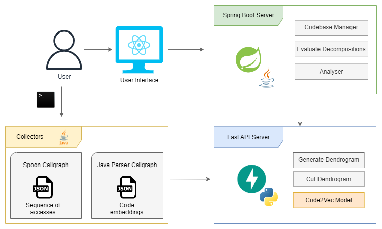

# Mono2Micro

Tools to migrate a monolith to a microservices architecture, focusing on microservices identification, where the set of identified microservices minimizes the number of system transactions (microservices) associated with a business transaction, aiming to control introduction of relaxed consistency in the system. Currently implemented for Spring-Boot monoliths that use FenixFramework and Spring Data ORMs.

# Architecture



## 1. Collectors

 - The collectors are responsible for collecting all the necessary data from a given codebase, either with static or dynamic analysis.

## 2. Spring Boot Server

 - The Spring Boot Server is responsible for managing all codebase information, evaluating decompositions, and running the analyzer module to generate all possible combinations to find the best parameters for each decomposition strategy. Since the Analyser module can take several days to run, an optimized version of the code can be found in the [/feature/cluster/code2vec](https://github.com/socialsoftware/mono2micro/tree/feature/cluster/code2vec) branch, to take advantage of all computer's cluster CPUs.

## 3. Fast API Server

 - The Fast API Server is responsible for the dendrogram operations, and also to expose the Code2Vec model.

## 4. User Inteface (Frontend)

 - The User Interface allows the user to create codebases by submitting the collectors data to the Spring Boot Server, and create and evaluate several decompositions.

## 5. Evaluation Playground

 - The Evaluation Playground is used to evaluate the strategies results data in order to generate graphics and statistic reports.


# Setup

## Pre-Requisites

- java 8+     (```java --version```)
- nodejs 10+  (```node --version```)
- npm 6+      (```npm --version```)
- python 3.5+ (```python --version```)
- pipenv 2022.6.7 (```pipenv --version```)

### Spring Boot Server Setup
- Create the file ```specific.properties``` in backend/src/main/resources with the correct python command (example in file ```specific.properties.example```)
- Due to a limitation in SpringBoot documented in https://github.com/spring-projects/spring-boot/issues/2895, .jar files cannot be generated with more than 655535 total files inside. Due to this, make sure the folder ```/codebases``` is empty before building the project.

### Fast API Server Setup

	cd scripts/
	mkdir models
	cd models
	wget https://code2vec.s3.amazonaws.com/model/java-large-released-model.tar.gz
	tar -xf java-large-released-model.tar.gz

## Run manually

### 1. To run the Collectors:

	cd collectors/
	see README.md for each collector

### 2. To run the Spring Boot Server:
	
    mkdir codebases
	cd backend/
	mvn clean install -DskipTests
	mvn spring-boot:run

### 3. To run the Fast API Server:
	
	cd scripts/
	pip install -r requirements.txt

### 4. To run the Frontend:

	cd frontend/
	npm install --legacy-peer-deps
	npm start

### 5. To run the Evaluation Playground:

	cd evaluation-playground/
	pipenv shell
	pipenv install # First time only
	python <script-file-name>.py

## Run using Docker

	docker-compose build
	docker-compose up

### Run using Docker, clean install

	docker-compose build --no-cache
	docker-compose up --build


# Repeat Code Vectorization Experiment

## 0. The data

- The codebases used in the experiment are included [here](https://drive.google.com/drive/folders/1QiAPyM4ezhihoqJdSEJNmwfNDNzzsYv1?usp=share_link).

- The actually codebases are: Acme-Academy-2.0 Acme-Polyglot-2.0 hexie Acme-AnimalShelter Acme-Rebujito hrm_backend Acme-Antenna Acme-Recycling hrportal Acme-Barter Acme-Rendezvous JavaSpringMvcBlog Acme-BnB Acme-Rookie jewelry Acme-Certifications Acme-Santiago jpabook Acme-Champions Acme-Series Acme-Chorbies AcmeShop learndemo-soufang Acme-CinemaDB Acme-Shout liuda Acme-Citizen Acme-Six-Pack Logos-ShopingCartUnregisteredUser Acme_CnG Acme-Sport-Centre market-manage Acme-Conference Acme-Supermarket myweb AcmeDistributor Acme-Taxi Acme-Events Acme-Trip reddit-app Acme-Un-Viaje ruanfan Skoolie Acme-Gallery AppPortal soad Acme-Hacker-Rank axon-trader SoloMusic Acme-HandyWorker AyjrFiance splunkwithaws-destination Acme-Inmigrant bag-database_adapted springblog Acme-Madruga bookstore-spring Acme-Meals cheybao Acme-Newspaper chorus-opensource spring-mvn-react Acme-Orienteering cloudstreetmarket.com StudyOnlinePlatForm Acme-Pad-Thai Corpore-Fit TwitterAutomationWebApp Acme-Parade Curso-Systema-Web-brewer wish Acme-Patronage dubai Acme-Personal-Trainer echo yydb Acme-Pet FirstWebShop

## 1. Parse the codebases under analysis and collect the respective data

- To perform this step, both spoon-callgraph and javaparser-callgraph are used.

- The spoon-callgraph is used to collect the entities' traces of each functionality present in the codebase.

- The javaparser-callgraph is used to collect all the methods callgraph and request the respective methods embeddings to the scripts (Fast API) server.

- For simplicity, the collected data of several codebases used in this experiment are zipped inside each collector (```/data/collection```). To run each one individually check each collector README.md.

## 2. Create the codebases

- The second step of this experiment is to register and persist the codebases data.

- This can be done by using the user interface adding one codebase at a time, or by executing the following bash script to create all codebases used in this experiment:

```bash
LAUNCHERLIST="keta-custom quizzes-tutor Acme-Food acme-furniture SpringBlog_Adapted spring-framework-petclinic"
MAVENLIST="Acme-Academy-2.0 Acme-Polyglot-2.0 hexie Acme-AnimalShelter Acme-Rebujito hrm_backend Acme-Antenna Acme-Recycling hrportal Acme-Barter Acme-Rendezvous JavaSpringMvcBlog Acme-BnB Acme-Rookie jewelry Acme-Certifications Acme-Santiago jpabook Acme-Champions Acme-Series Acme-Chorbies AcmeShop learndemo-soufang Acme-CinemaDB Acme-Shout liuda Acme-Citizen Acme-Six-Pack Logos-ShopingCartUnregisteredUser Acme_CnG Acme-Sport-Centre market-manage Acme-Conference Acme-Supermarket myweb AcmeDistributor Acme-Taxi Acme-Events Acme-Trip reddit-app Acme-Un-Viaje ruanfan Skoolie Acme-Gallery AppPortal soad Acme-Hacker-Rank axon-trader SoloMusic Acme-HandyWorker AyjrFiance splunkwithaws-destination Acme-Inmigrant bag-database_adapted springblog Acme-Madruga bookstore-spring Acme-Meals cheybao Acme-Newspaper chorus-opensource spring-mvn-react Acme-Orienteering cloudstreetmarket.com StudyOnlinePlatForm Acme-Pad-Thai Corpore-Fit TwitterAutomationWebApp Acme-Parade Curso-Systema-Web-brewer wish Acme-Patronage dubai Acme-Personal-Trainer echo yydb Acme-Pet FirstWebShop"
MAVENADMINLIST="WJKJ-center"
NOTHINGLIST="AppCan-coopMan"


for cb in $LAUNCHERLIST
do
        echo Creating codebase for $cb

        f1="codebaseName=${cb}"
        f2="datafile=@collectors/spoon-callgraph/data/collection/${cb}-launcher.json;type=application/json"
        f3="translationFile=@collectors/spoon-callgraph/data/collection/${cb}-launcher_IDToEntity.json;type=application/json"
        f4="translationEntityToIdFile=@collectors/spoon-callgraph/data/collection/${cb}-launcher_entityToID.json;type=application/json"
        f5="codeEmbeddingsFile=@collectors/javaparser-callgraph/data/collection/${cb}_code_embeddings.json;type=application/json"

        curl http://localhost:8080/mono2micro/codebase/create -X POST -H "accept: application/json" -F $f1 -F $f2 -F $f3 -F $f4 -F $f5
done

for cb in $MAVENLIST
do
        echo Creating codebase for $cb

        f1="codebaseName=${cb}"
        f2="datafile=@collectors/spoon-callgraph/data/collection/${cb}-maven.json;type=application/json"
        f3="translationFile=@collectors/spoon-callgraph/data/collection/${cb}-maven_IDToEntity.json;type=application/json"
        f4="translationEntityToIdFile=@collectors/spoon-callgraph/data/collection/${cb}-maven_entityToID.json;type=application/json"
        f5="codeEmbeddingsFile=@collectors/javaparser-callgraph/data/collection/${cb}_code_embeddings.json;type=application/json"

        curl http://localhost:8080/mono2micro/codebase/create -X POST -H "accept: application/json" -F $f1 -F $f2 -F $f3 -F $f4 -F $f5
done

for cb in $MAVENADMINLIST
do
        echo Creating codebase for $cb

        f1="codebaseName=${cb}"
        f2="datafile=@collectors/spoon-callgraph/data/collection/${cb}-admin-maven.json;type=application/json"
        f3="translationFile=@collectors/spoon-callgraph/data/collection/${cb}-admin-maven_IDToEntity.json;type=application/json"
        f4="translationEntityToIdFile=@collectors/spoon-callgraph/data/collection/${cb}-admin-maven_entityToID.json;type=application/json"
        f5="codeEmbeddingsFile=@collectors/javaparser-callgraph/data/collection/${cb}_code_embeddings.json;type=application/json"

        curl http://localhost:8080/mono2micro/codebase/create -X POST -H "accept: application/json" -F $f1 -F $f2 -F $f3 -F $f4 -F $f5
done

for cb in $NOTHINGLIST
do
        echo Creating codebase for $cb

        f1="codebaseName=${cb}"
        f2="datafile=@collectors/spoon-callgraph/data/collection/${cb}.json;type=application/json"
        f3="translationFile=@collectors/spoon-callgraph/data/collection/${cb}_IDToEntity.json;type=application/json"
        f4="translationEntityToIdFile=@collectors/spoon-callgraph/data/collection/${cb}_entityToID.json;type=application/json"
        f5="codeEmbeddingsFile=@collectors/javaparser-callgraph/data/collection/${cb}_code_embeddings.json;type=application/json"

        curl http://localhost:8080/mono2micro/codebase/create -X POST -H "accept: application/json" -F $f1 -F $f2 -F $f3 -F $f4 -F $f5
done

```

## 3. Run all strategy parameters combinations (Analyser)

- The third step consists of running all possible combinations of parameters for all five strategies over the 85 codebases under analysis. Since this process can take too long, there is an alternative branch called ```/feature/cluster/code2vec``` which is prepared to run in machines with a bigger number of CPUs.

- Only an example with 2 codebases of the previous generated results were left zipped inside the ```evaluation-playground/results``` folder, due to the large size of the files.

- It is recommended to use the following scripts instead of using the analyser present in the user interface because it generates a huge amount of data.

- As the script runs, the generated cuts and some auxiliary files are deleted to free memory, leaving only the files with the parameters used to generate each decomposition along with the values for cohesion, coupling, and complexity (```analyserResult.json```).

```bash
CODEBASES="myweb spring-mvn-react Acme-Shout JavaSpringMvcBlog axon-trader jpabook spring-framework-petclinic dubai bag-database_adapted reddit-app springblog Logos-ShopingCartUnregisteredUser SpringBlog_Adapted learndemo-soufang Curso-Systema-Web-brewer wish Acme_CnG StudyOnlinePlatForm quizzes-tutor keta-custom bookstore-spring Acme-Barter Acme-Rendezvous SoloMusic Acme-Sport-Centre Acme-Academy-2.0 Acme-Certifications Acme-Polyglot-2.0 Acme-Chorbies Acme-Antenna Acme-Food Acme-Madruga Acme-Newspaper AcmeDistributor Acme-Santiago Acme-Series Acme-Hacker-Rank Acme-Supermarket Acme-Patronage Acme-Trip Acme-BnB Acme-Citizen Acme-Six-Pack Acme-Inmigrant Acme-AnimalShelter Acme-Taxi acme-furniture Acme-Meals Acme-Orienteering Acme-Pet Skoolie Acme-Rookie Acme-Gallery Acme-Conference TwitterAutomationWebApp Acme-CinemaDB Acme-Events Acme-Rebujito cloudstreetmarket.com Acme-Personal-Trainer yydb cheybao Acme-Champions Acme-Parade AcmeShop Acme-HandyWorker Acme-Recycling Acme-Un-Viaje FirstWebShop Acme-Pad-Thai Corpore-Fit AppCan-coopMan jewelry soad market-manage ruanfan liuda echo hrm_backend hexie hrportal AyjrFiance chorus-opensource splunkwithaws-destination WJKJ-center"

for cb in $CODEBASES
do

    echo SA analysis for $cb

    /usr/bin/time -o $cb.sa.time.log curl http://localhost:8080/mono2micro/codebase/$cb/analyser -X POST -H "accept: application/json" -H "Content-type: application/json" -d '{"expert": {}, "profile": "Generic", "requestLimit": 0, "traceType": "ALL", "tracesMaxLimit": 0}'

    rm -rf codebases/$cb/analyser/cuts

    # -----------------------------------

    echo CA analysis for $cb

    /usr/bin/time -o $cb.ca.time.log curl http://localhost:8080/mono2micro/codebase/$cb/analyser/classes -X POST -H "accept: application/json" -H "Content-type: application/json" -d '{"expert": {}, "profile": "Generic"}'

    rm -rf codebases/$cb/analyser/classes/cuts

    # -----------------------------------

    echo EA analysis for $cb

    /usr/bin/time -o $cb.ea.time.log curl http://localhost:8080/mono2micro/codebase/$cb/analyser/entities -X POST -H "accept: application/json" -H "Content-type: application/json" -d '{"expert": {}, "profile": "Generic"}'

    rm -rf codebases/$cb/analyser/entities/cuts

    # -----------------------------------

    echo FAEA analysis for $cb

    /usr/bin/time -o $cb.faea.time.log curl http://localhost:8080/mono2micro/codebase/$cb/analyser/features/entitiesTraces -X POST -H "accept: application/json" -H "Content-type: application/json" -d '{"expert": {}, "profile": "Generic"}'

    rm -rf codebases/$cb/analyser/features/entitiesTraces/cuts

    # -----------------------------------

    echo FAMC analysis for $cb

    /usr/bin/time -o $cb.famc.time.log curl http://localhost:8080/mono2micro/codebase/$cb/analyser/features/methodCalls -X POST -H "accept: application/json" -H "Content-type: application/json" -d '{"expert": {}, "profile": "Generic"}'

    rm -rf codebases/$cb/analyser/features/methodCalls/cuts
    rm -rf codebases/$cb/features_embeddings_t*.json
done
```

## 4. Organize all the obtained results 

- This step consists of extracting the analyser results produced by the previous step, and organize them to facilitate their analysis.

- The following script move all the analyser results to the results folder. The names of the strategies folders have the previous names of the strategies. (CA -> CV, EA -> EV, FAEA -> FVSA, FAMC -> FVCG)

```bash
CODEBASES="myweb spring-mvn-react Acme-Shout JavaSpringMvcBlog axon-trader jpabook spring-framework-petclinic dubai bag-database_adapted reddit-app springblog Logos-ShopingCartUnregisteredUser SpringBlog_Adapted learndemo-soufang Curso-Systema-Web-brewer wish Acme_CnG StudyOnlinePlatForm quizzes-tutor keta-custom bookstore-spring Acme-Barter Acme-Rendezvous SoloMusic Acme-Sport-Centre Acme-Academy-2.0 Acme-Certifications Acme-Polyglot-2.0 Acme-Chorbies Acme-Antenna Acme-Food Acme-Madruga Acme-Newspaper AcmeDistributor Acme-Santiago Acme-Series Acme-Hacker-Rank Acme-Supermarket Acme-Patronage Acme-Trip Acme-BnB Acme-Citizen Acme-Six-Pack Acme-Inmigrant Acme-AnimalShelter Acme-Taxi acme-furniture Acme-Meals Acme-Orienteering Acme-Pet Skoolie Acme-Rookie Acme-Gallery Acme-Conference TwitterAutomationWebApp Acme-CinemaDB Acme-Events Acme-Rebujito cloudstreetmarket.com Acme-Personal-Trainer yydb cheybao Acme-Champions Acme-Parade AcmeShop Acme-HandyWorker Acme-Recycling Acme-Un-Viaje FirstWebShop Acme-Pad-Thai Corpore-Fit AppCan-coopMan jewelry soad market-manage ruanfan liuda echo hrm_backend hexie hrportal AyjrFiance chorus-opensource splunkwithaws-destination WJKJ-center"

mkdir ./evaluation-playground/results

for cb in $CODEBASES
do
	mkdir results/$cb

	mkdir results/$cb/SA

	mv codebases/$cb/analyser/analyserResult.json ./evaluation-playground/results/$cb/SA/

	mkdir results/$cb/CA

	mv codebases/$cb/analyser/classes/analyserResult.json ./evaluation-playground/results/$cb/CA/

	mkdir results/$cb/EA

	mv codebases/$cb/analyser/entities/analyserResult.json ./evaluation-playground/results/$cb/EA/

	mkdir results/$cb/FAEA

	mv codebases/$cb/analyser/features/entitiesTraces/analyserResult.json ./evaluation-playground/results/$cb/FAEA/

	mkdir results/$cb/FAMC

	mv codebases/$cb/analyser/features/methodCalls/analyserResult.json ./evaluation-playground/results/$cb/FAMC/
done
```

## 5. Analysis and Visualization of all the produced decompositions

- This step is done in the ```/evaluation-playground```, where it is possible to find several python scripts to generate the graphics presented in the article and also to perform the statistical analysis.

- All the results of the following scripts are going to the folder ```/evaluation-playground/evaluation```, which is already filled with the obtained results.

```bash
cd evaluation-playground
pipenv shell
pipenv install

cd Generic
python gen_cohesion.py
python gen_coupling.py
python gen_complexity.py
python gen_combined.py

python best_gen_cohesion.py
python best_gen_coupling.py
python best_gen_complexity.py
python best_gen_combined.py
cd ..

cd FVCG
python best_gen_md.py
python best_gen_lt_md2.py

python best_gen_fvcg_same_weights_versus_all_weights.py
python best_gen_fvcg_weights.py
python gen_fvcg_weights.py
python best_gen_md2_weights.py
cd ..

cd FVSA
python best_gen_fvsa_weights.py
python best_gen_lt.py
python gen_fvsa_weights.py
```

## Experimentation Data
- The monolith codebases used by the spoon-callgraph and commit-collection Collectors are available [here](https://drive.google.com/drive/folders/1QiAPyM4ezhihoqJdSEJNmwfNDNzzsYv1?usp=share_link). 
- The monolith representations, Access and Repository Based, for some of the codebases are available [here](https://drive.google.com/drive/folders/1X1RHtWwLlJvc-i6q1fmXK_xrfD9OjuRb?usp=share_link).


## Publications Data
- [ECSA2019](https://doi.org/10.1007/978-3-030-29983-5_3): [Collector Tool](https://github.com/socialsoftware/mono2micro/tree/master/collectors/java-callgraph)
- [ICSA2020](https://doi.org/10.1109/ICSA47634.2020.00024): [Replication Package](https://github.com/socialsoftware/mono2micro/tree/master/data/icsa2020)
- [ECSA2020](https://doi.org/10.1007/978-3-030-58923-3_3): [Evaluation Data](https://github.com/socialsoftware/mono2micro/tree/master/data/ecsa2020/evaluation)

## License
This project is licensed under the MIT License - see the [LICENSE](https://github.com/socialsoftware/mono2micro/blob/master/LICENSE) file for details.
